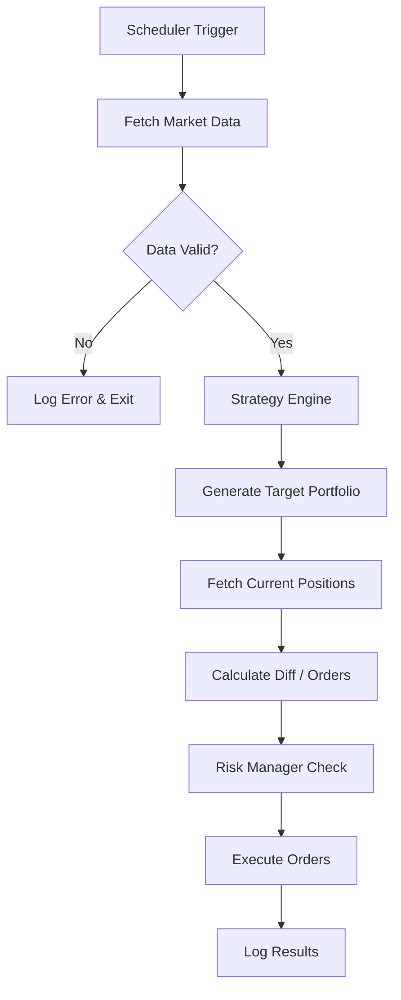

# System Architecture

## Design Principles
1.  **Workflow over Agents**: The system executes a linear, predictable pipeline. No autonomous loops that can get stuck.
2.  **Statelessness**: The bot should not "remember" state in variables between runs. It should rebuild state from the Broker API (current positions) and Data API (market history) every time.
3.  **Fail-Safe**: If any step fails (e.g., data fetch error), the bot aborts the run and logs the error, leaving the portfolio unchanged (or in a safe state).

## The Core Loop (Pipeline)
The bot runs on a schedule (e.g., Daily at 10:00 AM ET).

## Component Details

### 1. Scheduler (The "Heartbeat")
- **Role**: Wake up the app at specific times.
- **Tool**: Python `schedule` library or system `cron`.
- **Config**: `job_interval: "daily"`, `run_time: "09:45"`.

### 2. Data Service
- **Role**: Fetch standardized OHLCV bars.
- **Source**: Alpaca Market Data API (IEX feed for free tier).
- **Handling**: 
    - Retry logic (exponential backoff) for API limits.
    - Data normalization (adjust for splits/dividends if possible, though Alpaca handles splits).

### 3. Strategy Engine (The "Brain")
- **Input**: Historical DataFrame (Price History), Current Account Equity.
- **Output**: Target Allocation (e.g., `{"SPY": 0.5, "TLT": 0.5}`).
- **Constraint**: Must be a pure function. Same input = Same output.

### 4. Execution Engine
- **Role**: Sync "Current" to "Target".
- **Logic**:
    1.  Sell assets not in Target (or overweight).
    2.  Wait for cash settlement (simulated or immediate in paper).
    3.  Buy assets in Target.
- **Safety**: 
    - `max_order_size`: Never put >20% of equity in one trade (unless specified).
    - `dry_run` flag: If true, just log what would happen.

## Infrastructure

- **Hosting**: Docker container on a micro-VPS (e.g., AWS t3.micro, DigitalOcean Droplet).
- **Storage**: 
    - `app.log`: Text logs for debugging.
    - `trades.db` (SQLite): Structured history for dashboarding.
    - `config.json`: User settings.
- **Monitoring**:
    - Use a "Dead Man's Switch" (e.g., Healthchecks.io). The bot pings this URL upon successful completion. If the ping is missing, you get an email.

## Observability & UX
- **No-Code Dashboard**: A simple Streamlit app that reads `trades.db` and displays:
    - Current Holdings
    - Equity Curve
    - Recent Log Errors
- **Alerts**: Integration with Discord/Slack webhooks for "Trade Executed" or "Error" notifications.
